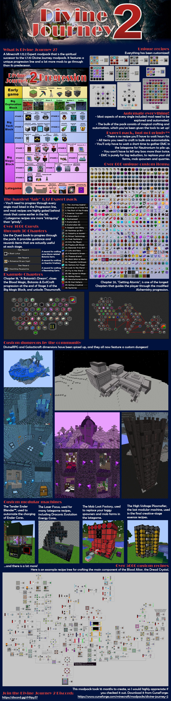

# Divine Journey 2

An Expert modpack for Minecraft 1.12.2.

By Atricos and a number of others - see the [Credits](readme/CREDITS.md).

 
 

Report bugs, typos, and other issues or request features the [issues](https://github.com/Divine-Journey-2/Divine-Journey-2/issues) tab on GitHub.

For more information, browse the GitHub or visit the official [CurseForge page](https://www.curseforge.com/minecraft/modpacks/divine-journey-2).

## Download

Download the pack on [GitHub](https://github.com/Divine-Journey-2/Divine-Journey-2/releases) or [CurseForge](https://www.curseforge.com/minecraft/modpacks/divine-journey-2/files).

## Modlist

View the modlist on [GitHub](readme/MODLIST.md), via the [auto-generated html](modlist.html), or [CurseForge](https://www.curseforge.com/minecraft/modpacks/divine-journey-2/relations/dependencies)

## Info for server owners

View [Server Info](readme/SERVER_INFO.md) for information on what dimensions to reset and what mods are clientside.

## Preview Images

A number of Preview Images have been made for the pack, which are visible on [GitHub](readme/PREVIEW_IMAGES.md) or on [CurseForge](https://www.curseforge.com/minecraft/modpacks/divine-journey-2/screenshots). These images may not be entirely accurate to the current status of the pack.

The primary self-promo image:

