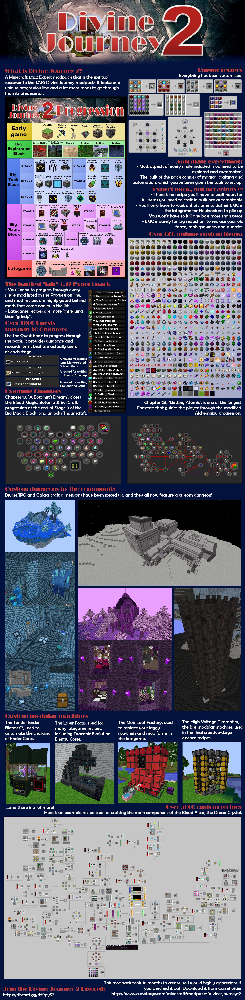

# Preview Images

These images and descriptions are used for the [CurseForge Screenshots page](https://www.curseforge.com/minecraft/modpacks/divine-journey-2/screenshots)

Note that many of these images were created when the pack was released, and may not be entirely accurate to the current status of the pack.

The Liquicrafter multiblock is used for a number of recipes, for example: Galacticraft Oil is refined from a combination of Actually Additions and Thermal Expansion Oil.

Everything goes into crafting the Essence of Infinity, which then goes into crafting the Infinity Catalyst, and eventually... the Infinity Ingot...!

You just need to craft a couple things.

...as custom items. There are Essences, Cores &amp; Reagents, 16 of each. Essences are crafted in the Alchemy Table, Reagents are crafted in the Hellfire Forge, Cores are a combination of the two.

Energized Certus Quartz and Energized Osmium Ingots are gating AE2 and Mekanism. Both are crafted with some Biodiesel.

The most important recipes.

It awakens...! Now what can THIS be used for?!

Who doesn't LOVE armor crafting chains...?!?!

Totemic requires Parrots for the Eagle transformation Ritual. They have been added to 16 new biomes so they're easier to find. This one's the Canyon biome added by Traverse!

Requires Totemic Buffalo Hide!

A simple machine that lets the player automate the charging of Ender Cores. (Normally these would have to be created by Right Clicking on an End Crystal in the End.)

Generates rarely in Eden. With decent loot I'd say!

Just me and the boys chillin' on Venus 8)

This is how to tier up various custom materials to get the final item of the Astral Sorcery section, the Galactic Ingot.

The get progressively more difficult and lead to the Nightmare Bed recipe (used to enter Vethea).

Most of it is actually baseline Mekanism. The idea is to convert Mekanism HDPE Pallets into Plastic.

Same as in Divine Journey 1. Requires an Induction Smelter!

Transition from LightningCraft to Astral Sorcery

A challenge at the end of the Thaumic Energistics section, to transform a conentric area into various biomes.

Some 7x7 recipes for LightningCraft and Extreme Reactors items

It points you to a secure room underneither a mysterious tree...
(Thank you to Ringu for the structure!)

Who doesn't LOVE nested crafting?!

Many of the early Tech mods and many of the midgame important recipes take a lot of Glowstone (as seen below), so a lot more has been added to the Nether.

This is the main (and most difficult) component of the Blood Altar. Aaaaand this is how you get it...!

Each Botania Flower has its own Petal, crafted in the Petal Apothecary, then the Flower is put together in the Roots Fey Crafter.

A.k.a. Galacticraft recipes. - Most machines that you only need to craft a couple of DO have a 7x7 recipe.

Who DOESN'T like Crystals? Each Thaumcraft Vis Crystals can be "upgraded". These are heavily used in the pack.

The most important items and blocks to get into AbyssalCraft and travel to Wildwool are crafted in a 5x5.

At the end of Alchemistry, the player gains access to the Fission multiblock, and the Weak Fusion multiblock. Along with the previously used Chemical Dissolver and Chemical Combiner, this is how to obtain the final item of the Chapter.

Basically the goal of the pack. Used to open the "Bag of Truth" that starts in your inventory.

Some more vanilla recipes

Going from the (beloved) Treated Leather from Divine Journey 1, all the way up to some Star Leather...!

There are 8 unique rooms (you can see the entrance of 4 of them of the picture), each of which contains a hidden button that can be activated to gain an Apalachian Key Fragment.

The goal of the pack is to open the Bag that starts in your inventory that contains "The Meaning of Life". Of course, since you'll need a Key to Infinity, you'll need to first beat the pack for it.

Plates are required for a lot of recipes. Later you'll be able to easily automate them with a Compressor.

The Main Menu

The Ancient Entity drops 2-4 Ancient Legs, The Watcher drops 1 Eye of the Watcher, and each member of the Ayeraco Horde (Green, Blue, Red, Yellow &amp; Purple Ayeraco) drops 1-2 Ayeraco Wings. They can be combined into an Unholy Token to enter Eden.

Used to overcharge items. It's capable of turning Draconic Cores into Wyvern Energy Cores for example.

Slightly more involved...! This will probably be a priority to autocraft. ;)

Some of you may remember these from DJ1! They have been reworked slightly, but are mostly the same idea.

Compressed Obsidians

AE2 Presses only generate underground in Atum in custom Meteorites.

Generates in Mortum. You'll need to climb up to the top and defeat Vamacheron to unlock Bewitchment!

Contains 2 puzzles, challenging mob-filled corridors and a boss at the end!

It cleans up your mess! Very handy.

Used to create 3 of the highest tier creative-stage Essences, the Essence of Matter, the Essence of Time and the Essence of Repetition!

